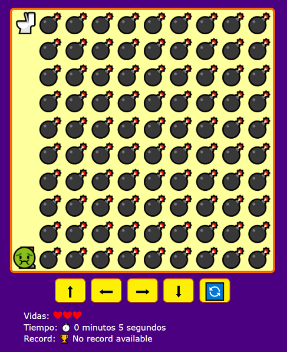

# nuevo-juego-javascript

Juego interactivo hecho con HTML, CSS y JavaScript puro. Lo que se usó de canvas es mínimo. 
El juego está basado en el curso de: <em>Taller Práctico de JavaScript: ¡Crea tu Primer Videojuego!</em> proporcionado por <strong>Platzi</strong>
 
<b>link del juego:</b> https://hectormaluy.github.io/nuevo-juego-javascript/ 
<b>link del curso:</b> https://platzi.com/cursos/javascript-practico-videojuegos/
  

